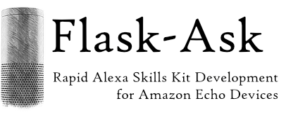

:orphan:

😎 `Lighten your cognitive load. Level up with the Alexa Skills Kit Video Tutorial <https://alexatutorial.com/>`_.

.. raw:: html

    

        <a class="github-button" href="https://github.com/johnwheeler/flask-ask" data-icon="octicon-star" data-style="mega" data-count-href="/johnwheeler/flask-ask/stargazers" data-count-api="/repos/johnwheeler/flask-ask#stargazers_count" data-count-aria-label="# stargazers on GitHub" aria-label="Star johnwheeler/flask-ask on GitHub">Star</a>
    

Welcome to Flask-Ask
====================

Building high-quality Alexa skills for Amazon Echo Devices takes time. Flask-Ask makes it easier and much more fun.
Use Flask-Ask with `ngrok <https://ngrok.com/>`_ to eliminate the deploy-to-test step and get work done faster.

Flask-Ask:

* Has decorators to map Alexa requests and intent slots to view functions
* Helps construct ask and tell responses, reprompts and cards
* Makes session management easy
* Allows for the separation of code and speech through Jinja templates
* Verifies Alexa request signatures

.. raw:: html

     
    <iframe width="560" height="315" src="https://www.youtube.com/embed/cXL8FDUag-s" frameborder="0" allowfullscreen></iframe>

Follow along with this quickstart on `Amazon
<https://developer.amazon.com/public/community/post/Tx14R0IYYGH3SKT/Flask-Ask-A-New-Python-Framework-for-Rapid-Alexa-Skills-Kit-Development>`_.

.. include:: contents.rst.inc

.. raw:: html

   
  <blockquote class="twitter-tweet" data-lang="en">
If you have an Alexa, Flask-Ask looks fantastic! <a href="https://t.co/vpoFsVNqI5">https://t.co/vpoFsVNqI5</a>
&mdash; Kenneth Reitz (@kennethreitz) <a href="https://twitter.com/kennethreitz/status/736234634292297729">May 27, 2016</a></blockquote>
  
